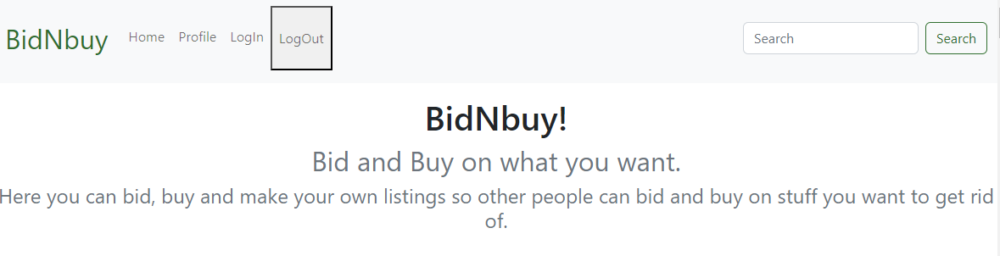

# BidNBuy




[](https://app.netlify.com/sites/bidnbuylittlaa/deploys)

## Description

Auction House:

- Users can add items to be bid on.
- Users can bid on other user's items.
- New users are given 1000 credits to use on the site.
- Users can get credits by selling items.
- Users can use credit to bid on items.
- Non - registered users can only search through the listings.

## Built with

- HTML
- CSS/SCSS
- Javascript

## Getting started

## Installing

1. Clone the Repo:

```md
git clone https://github.com/Littlaa/BidNbuy.git
```

2. Install Dependencies

```md
npm i
```

### Running

To run the app, run the following command:

```md
npm run start
```

### Goal

To take the skills learned over the past three semesters and create an auction website.

### User stories

The client has specified the following requirements in the form of User Stories:

- [x] A user with a stud.noroff.no email may register

- [x] A registered user may login

- [x] A registered user may logout

- [x] A registered user may update their avatar

- [x] A registered user may view their total credit

- [x] A registered user may create a Listing with a title, deadline date, media gallery and description

- [ ] A registered user may add a Bid to another user’s Listing

- [ ] A registered user may view Bids made on a Listing

- [ ] A registered user may use credit to make a Bid on another user’s Listing

- [ ] An unregistered user may search through Listings

#### Contributing

If you want to contribute to this auction house site - here are the steps you should follow:

1. Fork the project to your own GitHub profile.
2. Clone the fork on your local machine.
3. Create a branch where you will push your code.
4. Make changes - Comment the changes you do.
5. Push changes to GitHub.
6. Create a pull request for merge.

#### Contact

If you want to contact me, here is my information:

[My LinkedIn page](http://www.linkedin.com/in/mona-dagsland-56ba85226)
